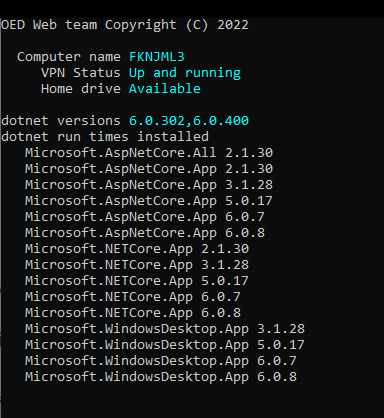
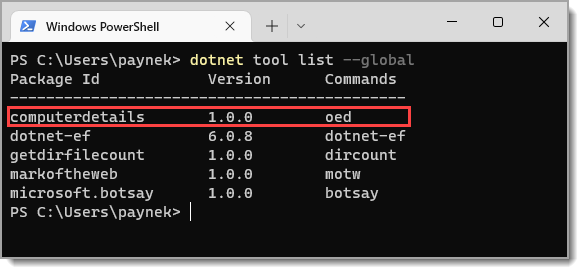

# About

A simple example for converting a console project to a `dotnet tool`

See 🠊 https://learn.microsoft.com/en-us/dotnet/core/tools/global-tools

Taken from 🠊 [here](https://github.com/karenpayneoregon/console-apps/tree/master/ComputerDetails)



# List tools


## Commands

cd C:\OED\DotnetLand\VS2022\Learn2022Solution\ComputerDetails

```
dotnet tool install --global --add-source ./nupkg computerdetails
dotnet tool uninstall -g computerdetails
```

