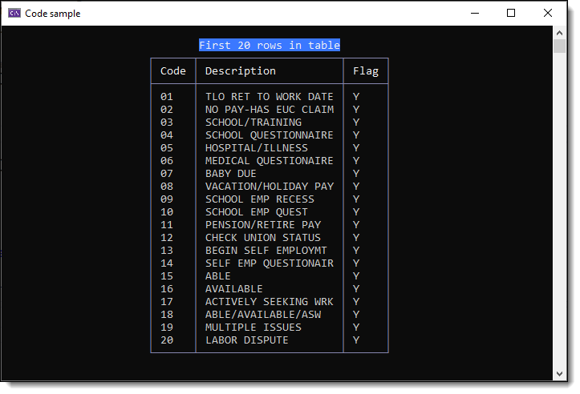

# About

Very basic example of reading data from an Oracle database.

- Since the table has no primary key use [[Keyless]](https://docs.microsoft.com/en-us/ef/core/modeling/keyless-entity-types?tabs=data-annotations)
- Connection string is located in a text file outside of this Visual Studio solution so not to expose the connection string. For a real app, the connection string would come a central, secure source.
- Table name and colun names use aliases as at least for me it's harsh to see all uppercased table and column names.
- One example fetchs all records while another uses [FirstOrDefaultAsync](https://docs.microsoft.com/en-us/dotnet/api/system.data.entity.queryableextensions.firstordefaultasync?view=entity-framework-6.2.0) for two conditions.
- Zero configuration is done on columns/properties.

```csharp
[Keyless]
[Table("LINE_FLAG_CODES")]
internal class LineFlagCodes
{
    [Column("CODE")]
    public string Code { get; set; }
    [Column("DESCR")]
    public string Description { get; set; }
    [Column("VALID_FLAG")]
    public string Valid_Flag { get; set; }
}
```

</br>

