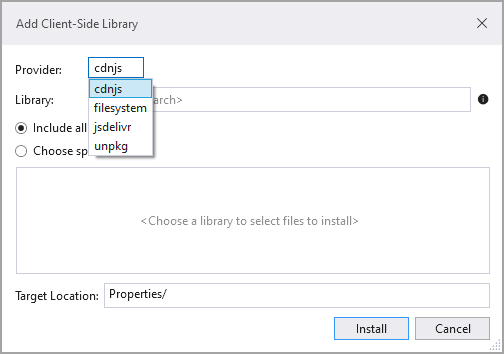
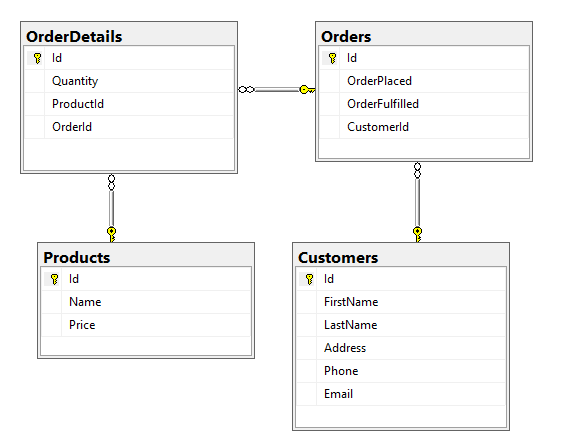

# About

This is a basic ASP.NET Core [^1] project using Razor Pages [^2] using Entity Framework Core 6 [^3] using Microsoft SQL-Server database.

# Project structure

Functionality is broken up as follows

## wwwroot

CSS, JavaScript libraries

## Pages/Shared

Site wide configuration

## Pages/Views

The `Pages` folder contains pages for each model [^4]. Under each folder e.g. the `Customers` folder are several pages, for

- Viewing data (list all records)
- Details view of data (one record)
- Editing data
- Removal of data

For this project I left some pages disconected or left out to show (if time permits) how to create a new page.

# CSS

CSS Isolation scopes [^5] which provides an elegant way to associate a style sheet to one page

```
{Your_namespace}.styles.css
```

# Libraries

Visual Studio has a component, `libman` which allows adding external libraries such as OED libraries and/or libraries such as BootStrap (ASP.NET Core comes with the current release of BootStrap).

**libman**



# Add code to a page

See the following [page](https://learn.microsoft.com/en-us/aspnet/web-pages/overview/getting-started/introducing-razor-syntax-c) for more.

The `@` character starts inline expressions, single statement blocks, and multi-statement blocks:

```csharp
<!-- Single statement blocks  -->
@{ var total = 7; }
@{ var myMessage = "Hello World"; }

<!-- Inline expressions -->
<p>The value of your account is: @total </p>
<p>The value of myMessage is: @myMessage</p>

<!-- Multi-statement block -->
@{
    var greeting = "Welcome to our site!";
    var weekDay = DateTime.Now.DayOfWeek;
    var greetingMessage = greeting + " Today is: " + weekDay;
}
<p>The greeting is: @greetingMessage</p>
```

Enclose code blocks in braces. A code block includes one or more code statements and is enclosed in braces.

```csharp
<!-- Single statement block.  -->
@{ var theMonth = DateTime.Now.Month; }
<p>The numeric value of the current month: @theMonth</p>

<!-- Multi-statement block. -->
@{
    var outsideTemp = 79;
    var weatherMessage = "Hello, it is " + outsideTemp + " degrees.";
}
<p>Today's weather: @weatherMessage</p>
```

# Entity Framework Core

- DbContext (under the `Data` folder)
    - Manage database connection
    - Configure model & relationship
    - Querying database
    - Saving data to the database
    - Configure change tracking
    - Caching
    - Transaction management

Samples were `context` is a `DbContext`

Get a `Customer` and their orders

```csharp
public static async Task<Customer> GetCustomer(int id)
{
    await using var context = new PizzaContext();
    return await context
        .Customers
        .Include(c => c.Orders)
        .FirstOrDefaultAsync(c => c.Id == id);
}
```

Update a `Customer` where the code is designed to update only first and last name. Caveat, the line with `IsModified = false` is ceremonial in that Entity Framework Core is smart enough on it's own to know what to update but in earlier versions we needed `IsModified = false`.

```csharp
public static async Task UpdateName(Customer currentCustomer)
{
    await using var context = new PizzaContext();
    var customer = context.Customers.FirstOrDefault(c => c.Id == currentCustomer.Id);

    if (customer is not null)
    {
        customer.FirstName = currentCustomer.FirstName;
        customer.LastName = currentCustomer.LastName;
        context.Entry(customer).State = EntityState.Modified;
        context.Entry(customer).Property(p => p.Email).IsModified = false;
        await context.SaveChangesAsync();
    }
}
```


- Models (under the `Models` folder)


# Database schema




# Resources

- Razor [syntax reference](https://learn.microsoft.com/en-us/aspnet/core/mvc/views/razor?view=aspnetcore-6.0) for ASP.NET Core
- ASP.NET Razor - [C# Code Syntax](https://gist.github.com/jwill9999/655533b6652418bd3bc94d864a5e2b49) 
- ASP.NET - [Razor Syntax Cheat](https://www.snippset.com/asp-net-razor-syntax-cheat-sheet-s586) sheet
- Dependency Injection in ASP.NET Core 6 [Course](https://app.pluralsight.com/library/courses/dependency-injection-asp-dot-net-core-6/table-of-contents)
- Concurrency conflicts
    - [Microsoft](https://learn.microsoft.com/en-us/aspnet/core/data/ef-rp/concurrency?view=aspnetcore-6.0&tabs=visual-studio)
    - Karen Payne working [example](https://github.com/karenpayneoregon/ef-core-6-tips/tree/master/TaxpayersConcurrencyCheck) done in a console project using [[ConcurrencyCheck](https://learn.microsoft.com/en-us/dotnet/api/system.componentmodel.dataannotations.concurrencycheckattribute?view=net-6.0)]


[^1]: Overview to [ASP.NET Core](https://learn.microsoft.com/en-us/aspnet/core/introduction-to-aspnet-core?view=aspnetcore-6.0)
[^2]:Introduction to [Razor Pages](https://learn.microsoft.com/en-us/aspnet/core/razor-pages/?view=aspnetcore-6.0&tabs=visual-studio) in ASP.NET Core
[^3]: Entity Framework Core 6
[^4]: A [model](https://learn.microsoft.com/en-us/ef/core/#the-model) is made up of entity classes and a context object that represents a session with the database. 
[^5]: CSS isolation means creating a CSS file like '.cshtml.css' for each razor page/view(.cshtml). CSS isolation helps to avoid dependencies on global styles that will be very hard to maintain and also avoid style conflicts among the nested content.