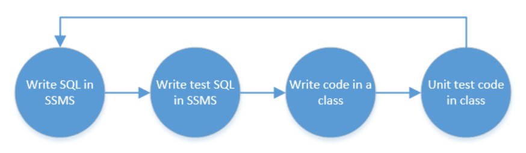

Always write your SQL statements in SSMS not in code if unsure of how to make a specific query

[Writing SQL for your application](See https://github.com/karenpayneoregon/writing-sql-queries-csharp)

Of course if you know the database inside and out, go for it.

If a query works in SSMS but not in an app.

- For EF Core setup logging [Simple logging for EF Core in Console project](https://github.com/karenpayneoregon/ef-core-6-tips/tree/master/LoggingOptionsApp)
- For conventional data provider [DbPeekQueryLibrary](https://www.nuget.org/packages/DbPeekQueryLibrary/) 

