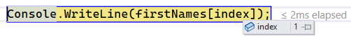
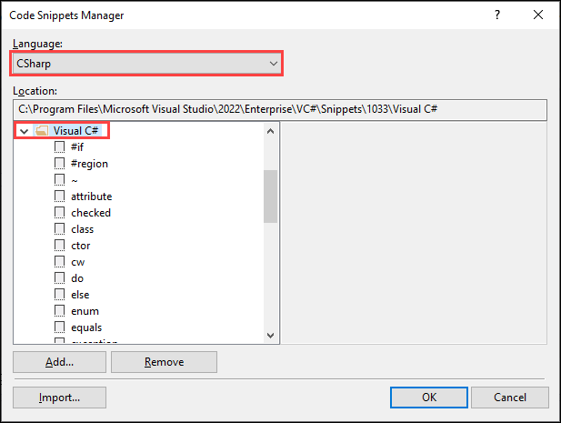
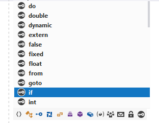

# Code snippets

[](index.md)


Code snippets are small blocks of reusable code that can be inserted in a code file using a right-click menu (context menu) command or a combination of hotkeys. They typically contain commonly used code blocks such as `try-finally`, `if` or `if-else` blocks, but they can be used to insert entire classes or methods.

`if` if<kbd>tab</kbd><kbd>tab</kbd>

```csharp
string firstName = "Jim";
if (firstName == "Jim")
{
                
}
```

`for` for<kbd>tab</kbd><kbd>tab</kbd>

```csharp
string[] firstNames = new[] { "Jim", "Adam", "Bob" };

for (int i = 0; i < firstNames.Length; i++)
{
    Console.WriteLine(firstNames[i]);
}
```

Caveat: never use `i`, instead use something like `index`

```csharp
for (int index = 0; index < firstNames.Length; index++)
{
    Console.WriteLine(firstNames[index]);
}
```

The main reason it is easier to see it along with when debugging it is easier to hover over `index` than `i`



`foreach` <kbd>tab</kbd><kbd>tab</kbd>

```csharp
string[] firstNames = new[] { "Jim", "Adam", "Bob" };


foreach (var firstName in firstNames)
{
    Console.WriteLine(firstName);
}
```

As with `i` in a `for`, in a foreach use a meaningful variable name.

To see a complete list of snippets, while in the code editor type <kbd>ctrl</kbd> + <kbd>K</kbd>,<kbd>B</kbd>



Another way to get at `snippets` is on a blank line in the code editor press <kbd>ctrl</kbd> + <kbd>space</kbd>

Besides `snippets` there will be types also


